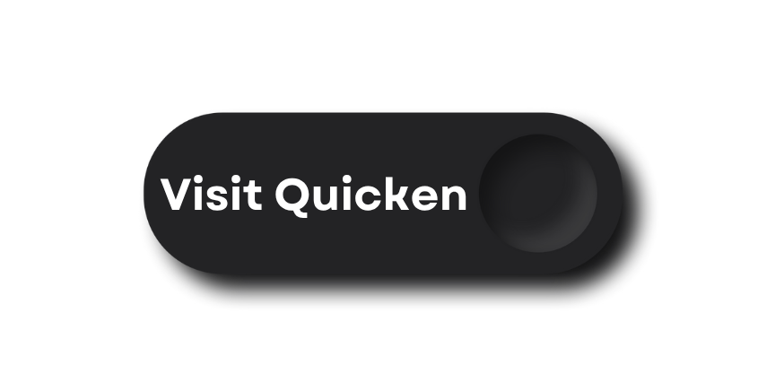

How to Download the Latest Version of Quicken in 2025 – A Complete Guide
=========================================================================

Looking for the easiest way to manage your finances in 2025? The latest version of **Quicken** is here to simplify your financial life with smarter features, cloud syncing, and powerful tools—all in one platform.

 What Is Quicken?
-------------------

Quicken is an all-in-one personal finance software trusted by millions of users for:

- Budgeting
- Investment tracking
- Bill payments
- Rental property management

Whether you're an individual, student, landlord, or entrepreneur, Quicken offers tailor-made solutions to suit your lifestyle.

Why Download the Latest Version of Quicken?
----------------------------------------------

Here’s what’s new and noteworthy in the 2025 release:

- **Smarter Budgeting**: Set up monthly, annual, or goal-based budgets
- **Real-Time Investment Tools**: Track performance, market value, and asset allocation
- **Cloud Backup & Mobile Sync**: Access your data anytime, anywhere
- **Bill Pay Integration**: Automate and schedule payments securely
- **Rental & Business Features**: Manage invoices, payments, and rent collection

.. note::
   Upgrading ensures maximum speed, security, and compatibility with the newest OS versions.

 How to Download Quicken – Step-by-Step Instructions
-------------------------------------------------------

Follow these simple steps to download and install Quicken:

1. Visit the `Quicken official download page <https://www.quicken.com/>`_
2. Choose your operating system: **Windows** or **Mac**
3. Select a subscription plan – Starter, Deluxe, Premier, or Home & Business
4. Click **Download Now** and save the installer
5. Open the file and follow the on-screen setup process
6. Launch Quicken and sign in or create a new account

.. tip::
   The entire process takes less than 5 minutes. No tech skills needed.

 Platform Compatibility
-------------------------

Quicken is available for:

- **Windows 10/11**
- **macOS Ventura, Monterey & newer**
- **iOS & Android** apps for financial tracking on the go

 Plan Comparison Table (2025 Edition)
---------------------------------------

+-------------------+--------------------------------------------------+----------------------------+
| **Plan**          | **Features**                                     | **Best For**              |
+===================+==================================================+============================+
| Starter           | Basic budgeting, account tracking                | Students & first-time users|
+-------------------+--------------------------------------------------+----------------------------+
| Deluxe            | Budgeting + investment tracking + savings goals | Salaried professionals     |
+-------------------+--------------------------------------------------+----------------------------+
| Premier           | Deluxe + Bill Pay + Priority Support            | Investors & households     |
+-------------------+--------------------------------------------------+----------------------------+
| Home & Business   | Premier + Invoicing + Rental Income tools       | Landlords, freelancers, SMEs|
+-------------------+--------------------------------------------------+----------------------------+

.. note::
   All plans come with mobile sync, cloud backup, and automatic bank feeds.

 Frequently Asked Questions (FAQs)
------------------------------------

**Q. Can I try Quicken for free?**  
Yes, Quicken offers a 30-day money-back guarantee with most plans.

**Q. Is Quicken safe to use?**  
Absolutely. Quicken uses bank-grade encryption and multi-factor authentication to protect your data.

**Q. Can I use Quicken offline?**  
Yes, Quicken runs offline on desktop, though features like cloud sync require internet.

**Q. Is the mobile app included?**  
Yes, Quicken’s mobile companion app is free with every subscription.

 Final Thoughts: Why You Should Download Quicken Today
--------------------------------------------------------

In a world of unpredictable expenses and shifting financial goals, having the right tools can make all the difference. With Quicken’s 2025 update, you get everything you need to take charge—accurately, securely, and efficiently.

👉 `Download Quicken Latest Version Now <https://www.quicken.com/>`_
